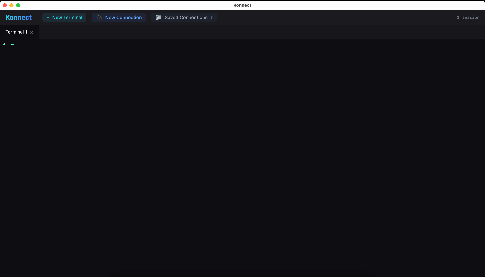

# Konnect

[English](./README_EN.md) | 中文

<p align="center">
  
  
  
  
</p>

一款轻量级现代化终端工具，基于 Tauri + React + TypeScript 构建。专为开发者和运维人员设计，提供快速、安全的远程连接体验。

## ✨ 功能特性

### 🚀 核心功能

| 功能 | 描述 |
|------|------|
| ⚡ **高性能后端** | 基于 Rust 构建，启动时间 < 1 秒，内存占用 < 50MB |
| 💻 **本地终端** | 完整的本地 Shell 支持，兼容 zsh、bash 等 |
| 🔐 **SSH 远程连接** | 支持密码和 SSH 密钥认证（RSA、Ed25519） |
| 🔑 **MFA 多因素认证** | 支持 Keyboard-Interactive 认证（如阿里云堡垒机、Google Authenticator） |
| 📁 **SFTP 文件管理** | 内置文件浏览器，支持上传、下载、删除操作 |
| 💾 **连接管理** | 持久化保存连接配置，一键快速访问 |
| 🔄 **会话恢复** | 重启应用后自动恢复上次打开的终端标签页 |

### 🎨 界面特性

- **深色主题** - 参考 Warp 的现代化设计语言
- **多标签页** - 同时管理多个终端会话
- **分屏视图** - 终端与 SFTP 并排显示
- **实时状态** - 连接状态、传输进度实时显示

## 🖥️ 截图
doc/20260111151558.png


## 🚀 快速开始

### 环境要求

- **Node.js** 18.0 或更高版本
- **Rust** 1.70.0 或更高版本
- **系统依赖**
  - macOS: Xcode Command Line Tools
  - Windows: Visual Studio Build Tools
  - Linux: `build-essential`, `libwebkit2gtk-4.1-dev`, `libssl-dev`

### 安装步骤

1. **克隆仓库**
   ```bash
   git clone https://github.com/TaylorChen/konnect.git
   cd konnect
   ```

2. **安装依赖**
   ```bash
   npm install
   ```

3. **开发模式运行**
   ```bash
   npm run tauri dev
   ```

4. **构建生产版本**
   ```bash
   npm run tauri build
   ```

## 📁 项目结构

```
konnect/
├── src/                    # React 前端代码
│   ├── components/         # UI 组件
│   │   ├── Terminal.tsx    # 终端组件
│   │   ├── SftpExplorer.tsx # SFTP 文件浏览器
│   │   └── ConnectionDialog.tsx # 连接对话框
│   ├── store/              # 状态管理
│   ├── types/              # TypeScript 类型定义
│   └── App.tsx             # 主应用入口
├── src-tauri/              # Rust 后端代码
│   ├── src/
│   │   ├── terminal/       # 本地终端模块
│   │   ├── ssh/            # SSH 连接模块
│   │   ├── sftp/           # SFTP 文件管理模块
│   │   ├── config/         # 配置存储模块
│   │   └── lib.rs          # 应用入口
│   └── Cargo.toml          # Rust 依赖配置
└── package.json            # Node.js 依赖配置
```

## 🛠️ 技术栈

| 层级 | 技术 |
|------|------|
| **前端框架** | React 18 + TypeScript |
| **样式** | TailwindCSS |
| **终端渲染** | Xterm.js |
| **桌面框架** | Tauri 2.0 |
| **后端语言** | Rust |
| **SSH/SFTP** | russh 0.56 + russh-sftp |
| **终端仿真** | portable-pty |

## 🤝 参与贡献

欢迎提交 Issue 和 Pull Request！

1. Fork 本仓库
2. 创建特性分支 (`git checkout -b feature/AmazingFeature`)
3. 提交更改 (`git commit -m 'Add some AmazingFeature'`)
4. 推送到分支 (`git push origin feature/AmazingFeature`)
5. 提交 Pull Request

### 开发规范

- 代码风格遵循 ESLint 和 Rustfmt 规范
- 提交信息遵循 [Conventional Commits](https://www.conventionalcommits.org/)
- 新功能需要包含相应测试

## 📄 许可证

本项目采用 [MIT License](./LICENSE) 开源协议。

## 🙏 致谢

- [Tauri](https://tauri.app/) - 提供跨平台桌面应用框架
- [Xterm.js](https://xtermjs.org/) - 提供终端模拟器
- [russh](https://github.com/warp-tech/russh) - 提供 SSH 协议实现
- [Warp](https://www.warp.dev/) - 界面设计灵感来源

---

<p align="center">Made with ❤️ by the Konnect Team</p>
